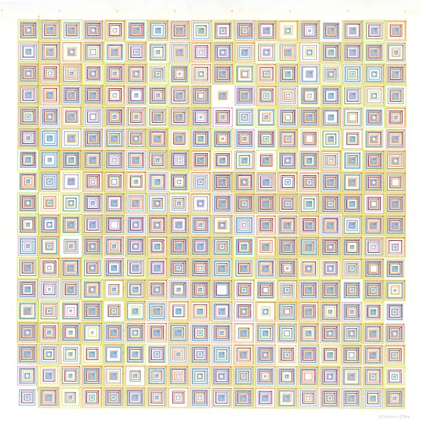

# DesOrdres

This is my attempt to recreate [(Des)Ordres, 1974](https://dam.org/museum/artists_ui/artists/molnar-vera/des-ordres/) by Vera Molnár.

## Original Work by Molnár

## Example Outputs from This Project

Example 1

Example 2

Note that each color is separated in the output SVG on its own Inkscape layer for use in plotter drawings (e.g., AxiDraw)

## Command Line Usage

From a set of input parameters, generate an SVG file with panels of a random number of rectangles with random offsets of vertices.

`python polygons -h` generates a list of command line options.

usage: polygons.py [-h] [--width WIDTH] [--height HEIGHT] [-m M_ROWS]
                   [-n N_COLS] [--n_colors N_COLORS]
                   [--colors COLORS [COLORS ...]] [--n_polygons N_POLYGONS]
                   [-j PCT_JITTER_VERTICES] [-r RANDOM_SEED]
                   [-o OUTPUT_FILE_BASENAME] [--append_datetime]

optional arguments:
  -h, --help            show this help message and exit
  --width WIDTH         drawing width in pixels
  --height HEIGHT       drawing height in pixels
  -m M_ROWS, --m_rows M_ROWS
                        count of rows
  -n N_COLS, --n_cols N_COLS
                        count of columns
  --n_colors N_COLORS   number of colors to use
  --colors COLORS [COLORS ...] list of hex colors e.g., #00FF00 #0000FF #FFFF00 #FF0000. Overrides n_colors.
  --n_polygons N_POLYGONS
                        Count of polygons per panel
  -j PCT_JITTER_VERTICES, --pct_jitter_vertices PCT_JITTER_VERTICES
                        max amount of polygon vertices to jitter as percentage
                        of polygon height/width e.g., 0.01
  -r RANDOM_SEED, --random_seed RANDOM_SEED
                        Seed for random generators
  -o OUTPUT_FILE_BASENAME, --output_file_basename OUTPUT_FILE_BASENAME
                        Output file basename
  --append_datetime     append unix timestamp to filename

